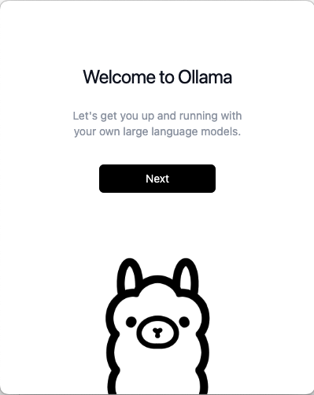

# 1. 你好，Ollama

大语言模型服务的构建其实很简单，只要老实返回“服务器繁忙，请稍后重试”就能吓唬住铁粉。但是启动个本地大语言模型就减少了被耍猴的风险，因此我们首先用Go语言开发的Ollama来在本地启动一个迷你版大语言模型。

## 1.1 安装Ollama

和当年的Docker类似，Ollama也是Go语言开发的轻量级的本地大模型（LLM）运行框架。Ollama的名字来源于"Llama"（美洲羊驼），但在开头加了一个字母"O"可能表示Open（开放）或Offline（离线）的意思。Ollama的Logo和吉祥物也是一个美洲羊驼。

Ollama通过CGO技术集成了一些C/C++库，他支持 Llama 2、Mistral、Gemma、DeepSeek 等模型，且支持 CPU 和 GPU 加速。首先去官网 [https://ollama.com/](https://ollama.com/) 下载安装包安装。macOS操作系统安装过程如图：

ch1-hello-llm/images /ch1.1-1-ollama.png


安装完成后在命令行查看`ollama`命令帮助。

```
$ ollama -h
Large language model runner

Usage:
  ollama [flags]
  ollama [command]

Available Commands:
  serve       Start ollama
  create      Create a model from a Modelfile
  show        Show information for a model
  run         Run a model
  stop        Stop a running model
  pull        Pull a model from a registry
  push        Push a model to a registry
  list        List models
  ps          List running models
  cp          Copy a model
  rm          Remove a model
  help        Help about any command

Flags:
  -h, --help      help for ollama
  -v, --version   Show version information

Use "ollama [command] --help" for more information about a command.
```

## 1.2 下载大模型

打开Ollame的大模型库页面 [https://ollama.com/library/deepseek-r1](https://ollama.com/library/deepseek-r1)，找到最小的DeepSeek模型执行：

```
$ ollama run deepseek-r1:1.5b
pulling manifest 
pulling aabd4debf0c8...   3% ▕                ▏  27 MB/1.1 GB  3.0 MB/s   5m57s
...
```

`deepseek-r1:1.5b`只有1.1 GB大小，下载完成后就直接进入了对话模式：

```
$ ollama run deepseek-r1:1.5b
pulling manifest 
pulling aabd4debf0c8... 100% ▕================▏ 1.1 GB
pulling 369ca498f347... 100% ▕================▏  387 B
pulling 6e4c38e1172f... 100% ▕================▏ 1.1 KB
pulling f4d24e9138dd... 100% ▕================▏  148 B
pulling a85fe2a2e58e... 100% ▕================▏  487 B
verifying sha256 digest 
writing manifest 
success 
>>> Send a message (/? for help)
/bye
```

也可以通过`ollama pull deepseek-r1:1.5b`命令只下载模型。下载后可以通过`ollama list`查看本地有哪些模型：

```
$ ollama list
NAME                ID              SIZE      MODIFIED    
deepseek-r1:1.5b    a42b25d8c10a    1.1 GB    2 weeks ago    
$
```

## 1.2 运行大模型

`ollama run`命令可以直接执行：

```
$ ollama run deepseek-r1:1.5b
>>> hello deepseek
<think>

</think>

Hello! How can I assist you today? 😊

>>> /bye
$
```

这其实是一个命令行客户端，客户端将指令发送到本地的ollama后台服务进程，然后就返回的结果显示在命令行界面。

我们终于可以自己跑大语言模型了：不仅不花钱也不怕断网，关键是草根码农在前AI时代也能持有一点点的生产资料。

## 1.3 停止运行大模型

当我们退出`ollama run`命令后，模型依然会在后台运行。可以通过`ollama ps`命令查看运行的模型：

```
$ ollama ps
NAME                ID              SIZE      PROCESSOR    UNTIL
deepseek-r1:1.5b    a42b25d8c10a    1.6 GB    100% CPU     3 minutes from now
$
```

因为运行模型需要大量的CPU资料，因此不需要的话最好通过`ollama stop`命令停止：

```
$ ollama stop deepseek-r1:1.5b
$ ollama ps
NAME    ID    SIZE    PROCESSOR    UNTIL 
$
```

停止后再执行`ollama ps`就看不到了。


