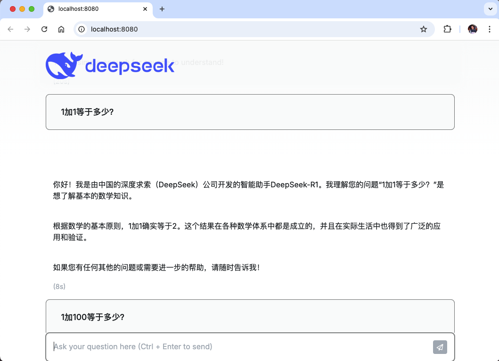

# 3. LLM聊天机器人

LangChain是专门用于开发LLM驱动型应用程序的框架，而LangChain Go是LangChain框架的Go语言实现。现在我们尝试用LangChain Go连接Ollama运行的本地大模型，然后构建一个LLM聊天机器人。

## 3.1 连接Ollama

通过LangChainGo连接Ollama非常简单：

```go
package main

import (
	"context"
	"fmt"

	"github.com/tmc/langchaingo/llms"
	"github.com/tmc/langchaingo/llms/ollama"
)

func main() {
	llm, _ := ollama.New(ollama.WithModel("deepseek-r1:1.5b"))
	completion, _ := llms.GenerateFromSinglePrompt(
		context.Background(), llm, "hello deepseek",
	)
	fmt.Println(completion)
}
```

本地执行结果如下：

```
$ go run .
<think>

</think>

Hello! How can I assist you today? 😊
```

## 3.2 命令行聊天程序

先构造一个命令行环境的聊天程序，每次对话不包含上下文信息。首先包装一个`LLMChat`函数：


```go
func LLMChat(prompt string) (string, error) {
	llm, err := ollama.New(ollama.WithModel("deepseek-r1:1.5b"))
	if err != nil {
		return "", err
	}

	return llms.GenerateFromSinglePrompt(context.Background(), llm, prompt)
}
```

然后再main函数中以交互的方式调用`LLMChat`函数：

```go
func main() {
	// 提示用户
	fmt.Println("请输入聊天对话内容，输入 '/bye' 退出。")

	// 循环读取输入
	scanner := bufio.NewScanner(os.Stdin)
	for {
		// 提示用户输入
		fmt.Print(">> ")

		// 读取一行输入
		scanner.Scan()
		input := scanner.Text()

		// 如果输入的是 'exit'，退出循环
		if strings.ToLower(input) == "/bye" {
			break
		}

		response, err := LLMChat(input)
		if err != nil {
			fmt.Printf("ERROR: %v\n", err)
			continue
		}
		fmt.Println(response)
	}
}
```

执行的效果如下：

```
$ go run .
请输入聊天对话内容，输入 '/bye' 退出。
>> hello deepseek
<think>

</think>

Hello! How can I assist you today? 😊
>> /bye
$
```

## 3.3 Web聊天程序

现在构建Web版本的聊天程序。先定义服务对象和公开的方法：

```go
type Option struct {
	Model string
}

type LLMChatServer struct {
	fs  fs.FS
	opt Option
}

func NewLLMChatServer(opt Option) *LLMChatServer {}
func (p *LLMChatServer) Run(addr string) error {}
```

`Option`是基本的配置参数，`LLMChatServer`是聊天服务对象，然后有个`LLMChatServer.Run()`启动服务。

然后在`main`函数可以调用以上的服务：

```go
func main() {
	s := NewLLMChatServer(Option{
		Model: "deepseek-r1:1.5b",
	})
	s.Run("localhost:8080")
}
```

然后在`http://localhost:8080`地址启动聊天服务。现在可以继续实现`NewLLMChatServer`构造函数：

```go
//go:embed static
var embedStaticFS embed.FS

func NewLLMChatServer(opt Option) *LLMChatServer {
	fs, err := fs.Sub(embedStaticFS, "static")
	if err != nil {
		panic(err)
	}
	p := &LLMChatServer{fs: fs, opt: opt}
	return p
}
```

首先是嵌入`static`目录，其中包含聊天的前端资源。然后完善`Option`缺少的参数，最后构建`LLMChatServer`对象返回。

接着是实现`LLMChatServer.Run()`方法：

```go
func (p *LLMChatServer) Run(addr string) error {
	fmt.Println("listen on http://" + addr)
	startTime := time.Now()
	return http.ListenAndServe(addr,
		http.HandlerFunc(func(w http.ResponseWriter, r *http.Request) {
			fmt.Println(r.Method, r.URL.Path)

			switch {
			case r.URL.Path == "/":
				p.indexHandler(w, r)
			case r.URL.Path == "/run":
				p.runHandler(w, r)
			case strings.HasPrefix(r.URL.Path, "/static/"):
				relpath := strings.TrimPrefix(r.URL.Path, "/static/")
				data, err := fs.ReadFile(p.fs, relpath)
				if err != nil {
					http.NotFound(w, r)
					return
				}

				http.ServeContent(w, r, r.URL.Path, startTime, bytes.NewReader(data))

			default:
				http.NotFound(w, r)
			}
		}),
	)
}
```

注意是通过`http.ListenAndServe()`设置理由处理函数并启动服务。其中“/”路径对应聊天主页面的处理`p.indexHandler(w, r)`，“/run”提供和大模型聊天的REST接口`p.runHandler(w, r)`，“/static/*”则是静态文件。

聊天主页面的处理逻辑比较简单，就是将`static/index.html`资源的内容返回：

```go
func (p *LLMChatServer) indexHandler(w http.ResponseWriter, r *http.Request) {
	data, err := fs.ReadFile(p.fs, "index.html")
	if err != nil {
		http.Error(w, err.Error(), http.StatusInternalServerError)
		return
	}
	w.Write(data)
}
```

然后是`/run`接口的实现：

```go
func (p *LLMChatServer) runHandler(w http.ResponseWriter, r *http.Request) {
	prompt := struct {
		Input string `json:"input"`
	}{}
	err := json.NewDecoder(r.Body).Decode(&prompt)
	if err != nil {
		http.Error(w, err.Error(), http.StatusBadRequest)
		return
	}

	resp, err := LLMChat(prompt.Input)
	if err != nil {
		http.Error(w, err.Error(), http.StatusInternalServerError)
		return
	}
	json.NewEncoder(w).Encode(map[string]string{
		"input":    prompt.Input,
		"response": resp,
	})
}
```

通过接收客户端发送来的JSON数据，解析出其中的“input”字段作为聊天的内存，然后调用`LLMChat(prompt.Input)`获取大模型返回的内存，最终再以JSON格式编码并返回。

现在执行服务后用浏览器打开的效果如图：



## 3.4 多轮对话

通过`llm.GenerateContent()`函数可以传入多轮对话的上下文：

```go
func main() {
	llm, err := ollama.New(ollama.WithModel("deepseek-r1:1.5b"))
	if err != nil {
		panic(err)
	}

	requestContent := []llms.MessageContent{
		llms.TextParts(llms.ChatMessageTypeHuman, "你好，今天怎么样？"),
		llms.TextParts(llms.ChatMessageTypeSystem, "你好呀！我今天很好，谢谢！"),
		llms.TextParts(llms.ChatMessageTypeHuman, "你做了什么？"),
		llms.TextParts(llms.ChatMessageTypeSystem, "我今天一直在和你聊天！"),
		llms.TextParts(llms.ChatMessageTypeHuman, "那我们继续聊吧！"),
	}

	completion, err := llm.GenerateContent(context.Background(), requestContent)
	if err != nil {
		panic(err)
	}
	if len(completion.Choices) == 0 {
		panic("no response")
	}

	fmt.Println(completion.Choices[0].Content)
}
```

执行效果如下：

```
$ go run .
<think>
...
</think>

你好呀！今天确实过得很好，谢谢你的关心！你最近一直在和我聊天吗？有什么特别的事情想分享吗？
```

其中`<think>`和`</think>`之间标注的思考过程如下：

> 嗯，用户一开始说“你好呀！我今天很好，谢谢！”然后回复了“我今天一直在和你聊天！”看起来是在确认之前的对话。接着，用户又问：“你做了什么？”这可能是在测试我的反应是否正常。
> 
> 接下来，我回复了“你好，今天怎么样？”，这是一个友好的回应，让用户感到被重视。然后，我继续说：“那我们继续聊吧！”这样引导用户继续互动，保持对话的持续性。
> 
> 用户最后回复的是“那我们继续聊吧！”，这表明他们已经同意我的建议，并希望进一步交流。可能用户觉得之前的回复不够友好，或者想确认是否真的在聊天，所以再次确认了话题。
> 
> 总的来说，用户的对话主要是在确认和对方的聊天情况，同时保持友好的互动。我需要确保回应既友好又积极，让用户感到被支持。

简单来说，多轮对话会让大模型以深度思考模式工作。这里就不展示集成到Web聊天程序的细节了。


